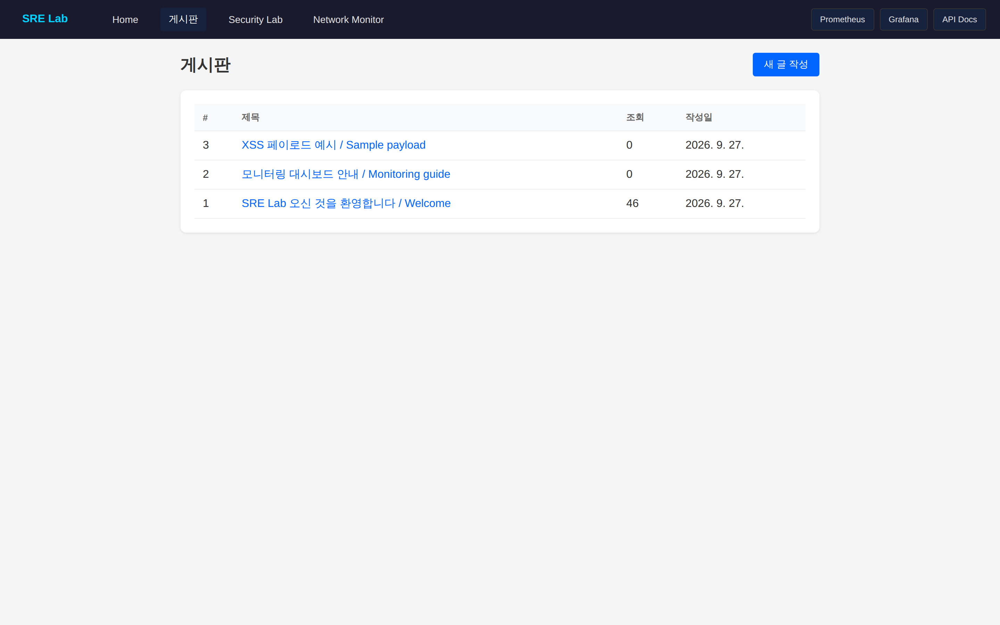
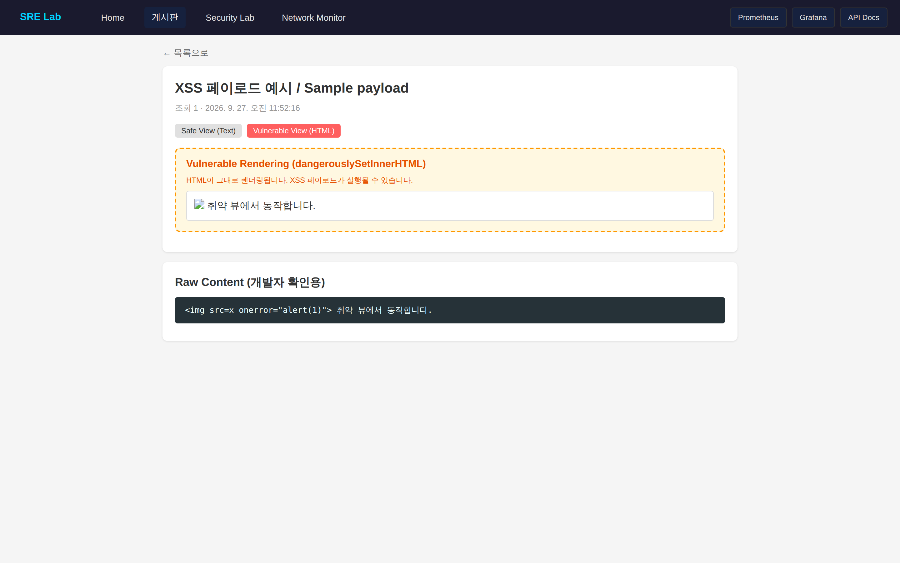
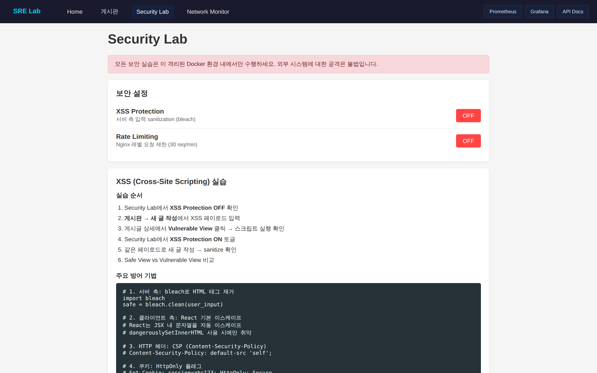
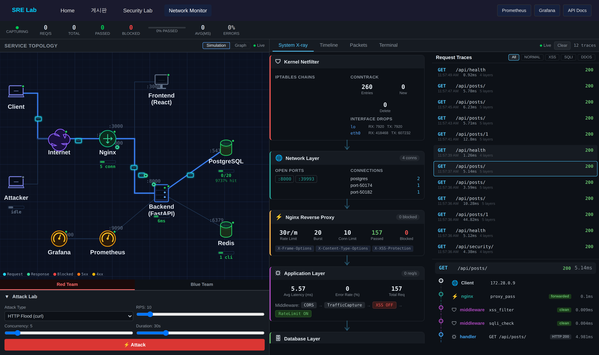
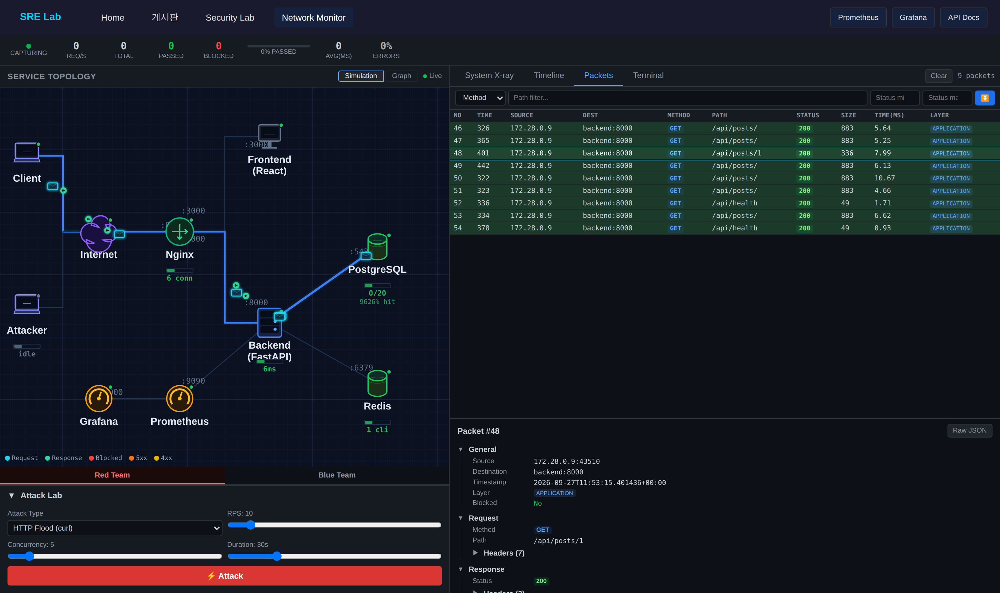
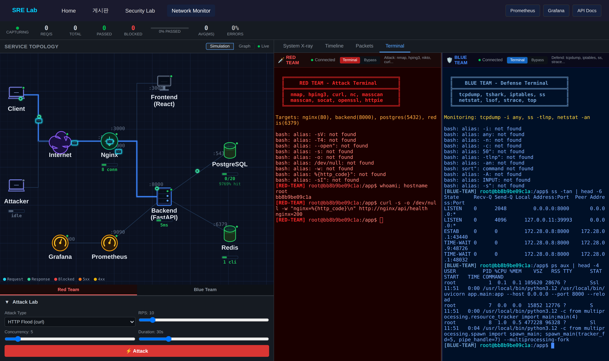
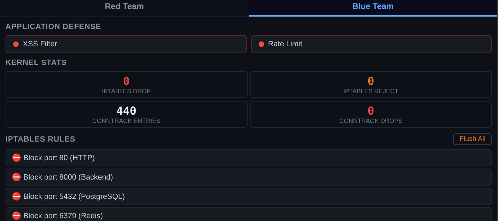
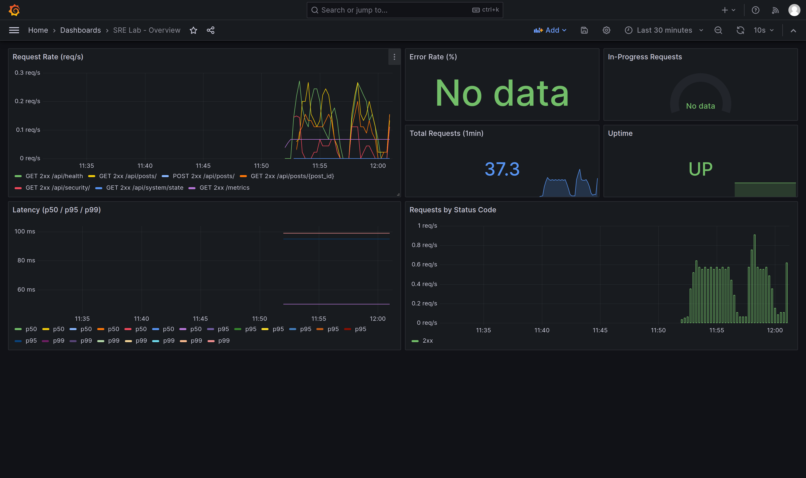
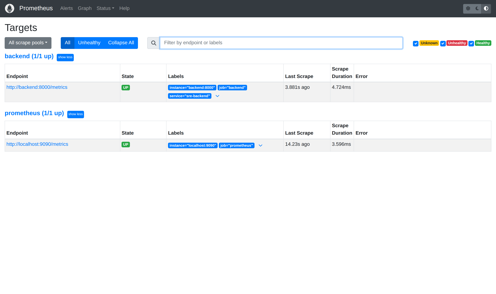

# SRE Practice Lab

> 웹 서비스 한 벌을 Docker로 띄우고, 그 위에서 트래픽·보안·모니터링을 눈으로 보며 실습하는 랩입니다.
> A self-contained web stack on Docker for hands-on practice with traffic, security, and monitoring — all made visible in the browser.


---

## 목차 / Table of Contents

- [기술 스택 / Tech Stack](#기술-스택--tech-stack)
- [빠른 시작 / Quick Start](#빠른-시작--quick-start)
- [서비스 주소 / Service Endpoints](#서비스-주소--service-endpoints)
- [기능 설명 / Features](#기능-설명--features)
  - [1. 게시판 / Board](#1-게시판--board)
  - [2. Security Lab (XSS)](#2-security-lab-xss)
  - [3. Network Monitor](#3-network-monitor)
  - [4. 모니터링 / Monitoring](#4-모니터링--monitoring)
- [주의사항 / Safety](#주의사항--safety)
- [문서 / More Docs](#문서--more-docs)

---

## 기술 스택 / Tech Stack

| 영역 / Area | 사용 기술 / Technology |
| --- | --- |
| Backend | Python 3.12, FastAPI 0.109, SQLAlchemy 2.0 (async), asyncpg, Pydantic 2, structlog, bleach |
| Frontend | React 18, React Router 6, ReactFlow 11, xterm.js 5, axios, HTML Canvas |
| Data | PostgreSQL 16, Redis 7 |
| Proxy | Nginx 1.25 (reverse proxy, rate limit, security headers) |
| Monitoring | Prometheus 2.50, Grafana 10.3, Alertmanager 0.27, prometheus-fastapi-instrumentator |
| Load / Attack | Locust, httpx 기반 traffic-generator |
| Runtime | Docker, Docker Compose |

---

## 빠른 시작 / Quick Start

```bash
# 전체 서비스 빌드 & 실행 / Build and start everything
docker compose up -d --build

# 상태 확인 / Check status
docker compose ps

# 로그 / Logs
docker compose logs -f

# 종료 / Stop
docker compose down
```

실행 후 브라우저에서 **http://localhost:8080** 으로 접속합니다.
After startup, open **http://localhost:8080** in your browser.

> Nginx(`:8080`)를 통해 접속하세요. 프론트엔드와 API가 함께 프록시됩니다.
> Use the Nginx entry point (`:8080`); it proxies both the frontend and the API.

---

## 서비스 주소 / Service Endpoints

| 서비스 / Service | URL | 설명 / Note |
| --- | --- | --- |
| **Nginx (메인 / main)** | http://localhost:8080 | 프론트엔드 + API 프록시 / frontend + API proxy |
| Frontend | http://localhost:3002 | 직접 접근 / direct (no API proxy) |
| Backend API | http://localhost:8000 | REST API |
| API Docs (Swagger) | http://localhost:8000/docs | 자동 생성 API 문서 / auto-generated docs |
| Prometheus | http://localhost:9090 | 메트릭 / metrics |
| Grafana | http://localhost:3001 | 대시보드 / dashboard (`admin` / `admin`) |
| Alertmanager | http://localhost:9093 | 알림 / alerting |

> Grafana의 `admin / admin`은 로컬 실습용 기본값입니다. 외부에 공개하지 마세요.
> The Grafana `admin / admin` login is a local-only default. Do not expose it publicly.

---

## 기능 설명 / Features

### 1. 게시판 / Board

글을 작성하고 목록·상세로 볼 수 있는 기본 CRUD 게시판입니다. XSS 실습의 입력 창구로 쓰입니다.
A basic CRUD board (list / detail / create). It is also the input surface for the XSS lab.



상세 화면에서는 같은 글을 **Safe View(텍스트)** 와 **Vulnerable View(HTML)** 두 방식으로 렌더링해 비교할 수 있습니다.
On the detail page the same post can be rendered as **Safe View (text)** or **Vulnerable View (HTML)**, side by side for comparison.



- **Safe View**: 서버에서 `bleach`로 정제한 `content_safe`를 텍스트로 표시 / shows the server-sanitized `content_safe` as plain text.
- **Vulnerable View**: 원본 HTML을 `dangerouslySetInnerHTML`로 그대로 렌더링 → 페이로드 실행 / renders raw HTML via `dangerouslySetInnerHTML`, so a payload executes.

### 2. Security Lab (XSS)

XSS 보호와 Rate Limiting을 토글하고, 실습 순서와 방어 코드 예시를 확인하는 화면입니다.
A page to toggle XSS protection and rate limiting, with a step-by-step lab guide and defense-code examples.



실습 순서 / Lab steps:

1. `XSS Protection`을 OFF로 두고, 게시판에 페이로드(예: ``)로 새 글 작성
   Leave `XSS Protection` OFF and create a post with a payload such as ``.
2. 상세에서 **Vulnerable View**를 눌러 스크립트 실행 확인
   Open the post and click **Vulnerable View** to see the script fire.
3. `XSS Protection`을 ON으로 바꾼 뒤 같은 페이로드로 새 글 작성 → 정제 결과 비교
   Turn `XSS Protection` ON, post the same payload again, and compare the sanitized result.

### 3. Network Monitor

이 프로젝트의 중심 화면입니다. 실제 요청을 잡아 토폴로지·계층·패킷·터미널로 동시에 보여 줍니다.
The centerpiece of the project. It captures real requests and shows them at once as a topology, a layer view, a packet table, and live terminals.

**토폴로지 시뮬레이션 / Topology simulation** — 실제 트래픽을 패킷 애니메이션으로 그립니다. Attack Lab에서 부하를 걸면 패킷이 흐르고 차단·드롭이 시각화됩니다.
Draws live traffic as animated packets on a Packet-Tracer-style canvas. Run a load from the Attack Lab and packets flow, with drops and blocks visualized. (상단 GIF / see the GIF above.)

**System X-ray** — 하나의 요청이 커널(netfilter) → 네트워크 → Nginx → 애플리케이션 → DB 계층을 지나는 경로와 각 계층 지표를 보여 줍니다. 오른쪽 트레이스를 누르면 요청별 흐름이 펼쳐집니다.
Shows one request travelling through kernel (netfilter) → network → Nginx → application → DB, with per-layer stats. Click a trace on the right to expand its flow.



**패킷 인스펙터 / Packet inspector** — Wireshark 형식의 표에서 요청을 상태 코드별 색으로 보고, 선택하면 헤더·바디를 트리로 확인합니다.
A Wireshark-style table color-coded by status; select a row to inspect headers and body as a tree.



**Red / Blue 터미널 / Red & Blue terminals** — 백엔드 컨테이너 안의 실제 PTY 셸 두 개를 브라우저에서 씁니다. Red는 공격 도구(nmap, hping3, curl 등), Blue는 방어·관측 도구(tcpdump, ss, iptables 등)를 갖추고 있습니다.
Two real PTY shells inside the backend container, driven from the browser. Red carries offensive tools (nmap, hping3, curl…), Blue carries defensive/observability tools (tcpdump, ss, iptables…).



**Defense Lab (Blue Team)** — XSS 필터·Rate Limit 토글, 커널 통계(iptables drop/reject, conntrack), 포트 차단 규칙 프리셋을 한 곳에서 다룹니다.
Toggles for XSS filter and rate limit, kernel stats (iptables drop/reject, conntrack), and port-blocking rule presets in one panel.



### 4. 모니터링 / Monitoring

**Grafana 대시보드 / Grafana dashboard** — 요청률, 지연(p50/p95/p99), 상태 코드 분포, 총 요청 수, 업타임을 백엔드 메트릭에서 실시간으로 봅니다.
Request rate, latency (p50/p95/p99), status-code distribution, total requests, and uptime, live from backend metrics.



**Prometheus 타깃 / Prometheus targets** — 백엔드(`/metrics`)와 Prometheus 자신을 스크레이프합니다.
Scrapes the backend (`/metrics`) and Prometheus itself.



---

## 주의사항 / Safety

모든 공격 실습은 **이 프로젝트의 격리된 Docker 환경 안에서만** 하세요. 외부 시스템을 대상으로 한 공격은 불법입니다.
Run every attack exercise **only inside this project's isolated Docker environment**. Attacking any external system is illegal.

백엔드에 포함된 공격/방어 도구와 브라우저 터미널은 인증이 없습니다. 로컬 실습 용도로만 사용하고, 이 스택을 공개 네트워크에 노출하지 마세요.
The bundled offensive/defensive tools and the browser terminals have no authentication. Use them for local practice only, and never expose this stack to a public network.

---

## 문서 / More Docs

- [STATUS.md](STATUS.md) — 프로젝트 최종 목표와 현재 구현 현황 / final goal and current implementation status
- [ROADMAP.md](ROADMAP.md) — 학습 로드맵 / learning roadmap
